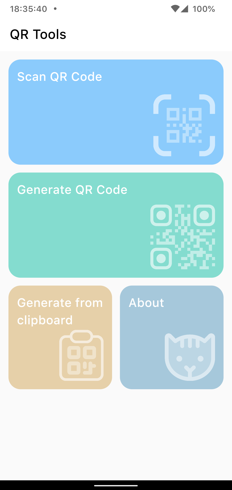
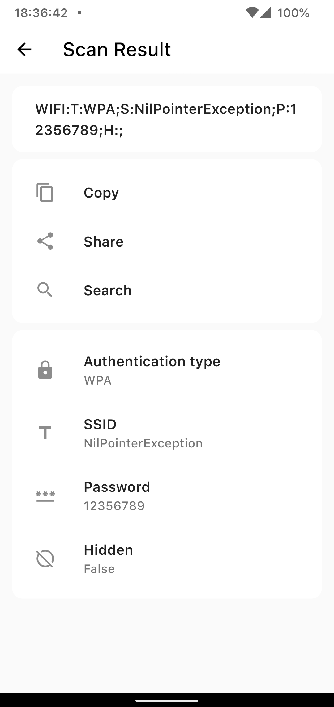
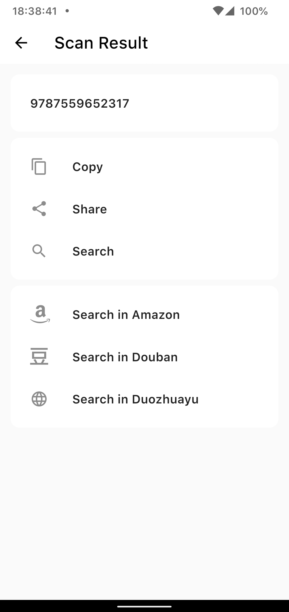
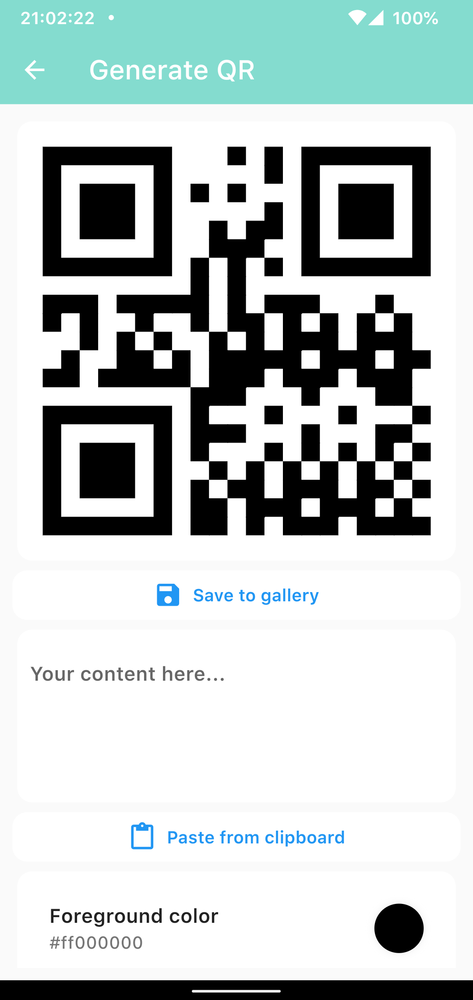
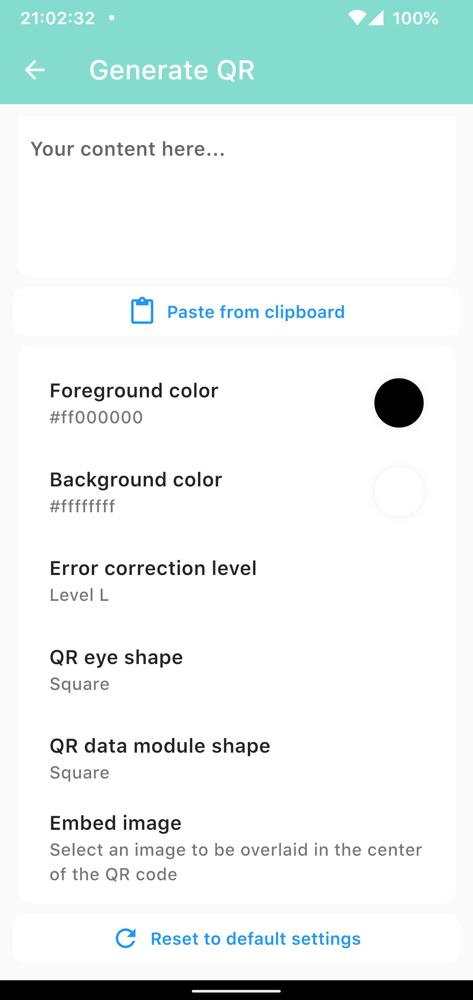

# QR Tools

A simple QR code scanner and generator written in Flutter.

# Features

- A simple QR code scanner.
- Support parsing various types of QR codes (Wi-Fi, ISBN, Phone, SMS, URL).
- A customizable QR code generator.
- Request only the necessary permissions.
- Open source and no any trackers and ads.

# Screenshots

| Home                   | Screen Result (Wi-Fi)  | Screen Result (ISBN)   |
| ---------------------- | ---------------------- | ---------------------- |
|  |  |  |

| Generate QR            | Generate QR Settings   | About                  |
| ---------------------- | ---------------------- | ---------------------- |
|  |  |  |

# Download

Download the apk from [Releases](https://github.com/LGiki/qr-tools/releases) page.

# Thanks

- App icon: [Qr code scan icons created by Uniconlabs - Flaticon](https://www.flaticon.com/free-icons/qr-code-scan)

# License

MIT
